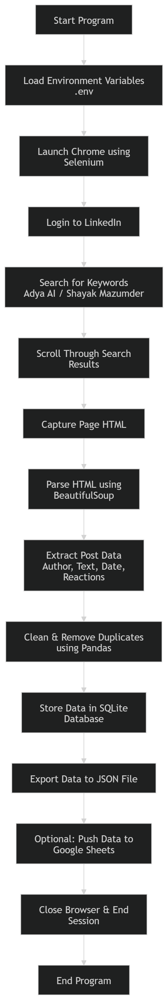

# LinkedIn Scraper – Adya AI

This project is a simple automation tool that collects LinkedIn posts mentioning **Adya AI** or specific people.
It uses **Python, Selenium, and BeautifulSoup** to automatically open LinkedIn, search posts, extract the data, and store it for analysis.
The scraper runs through a **Jupyter Notebook in VS Code** and saves the results in **JSON, SQLite database, and optionally Google Sheets**.

# What This Project Does
- Automatically logs in to LinkedIn
- Searches for posts containing specific keywords (like "Adya AI")
- Scrolls through search results
- Extracts information from posts
- Saves the data for later analysis

Data collected from each post includes:

- Post text  
- Author name  
- Author headline  
- Author profile URL  
- Post URL  
- Date posted  
- Reactions count  
- Comments count  
- Reposts count  

# Tech Stack
- Python  
- Selenium  
- BeautifulSoup  
- Pandas  
- SQLite  
- Google Sheets API (optional)  
- Jupyter Notebook  
- VS Code  

# Project Structure
linkedin_scraper/
│
├── linkedin_scraper.ipynb
├── requirements.txt
├── .env.template
├── .gitignore
│
├── output/
│   ├── linkedin_mentions.json
│   └── linkedin_posts.db
```

# Setup Instructions

## 1. Install Python

Download Python from:

https://www.python.org/downloads/

During installation make sure to check:

```
Add Python to PATH
```

Check installation:

```
python --version
```
## 2. Install VS Code Extensions

Install these extensions in VS Code:

- Python (Microsoft)
- Jupyter (Microsoft)


## 3. Open the Project Folder

Create a folder such as:

```
linkedin_scraper
```

Place all project files inside this folder and open it in VS Code.

---

## 4. Create Virtual Environment

Open the terminal in VS Code and run:
python -m venv .venv

Activate the environment:
.venv\Scripts\activate

You should see:
(.venv)

## 5. Install Required Packages
Run:
pip install -r requirements.txt

## 6. Configure Environment File
Rename the file:
.env.template
to
.env

Then fill your credentials:
LINKEDIN_EMAIL=your_email
LINKEDIN_PASSWORD=your_password
GOOGLE_SHEET_NAME=Adya AI LinkedIn Mentions
SERVICE_ACCOUNT_JSON=service_account.json

# Running the Scraper
Open the notebook:
linkedin_scraper.ipynb
Select the **.venv kernel**.

Run the cells **from top to bottom**.

The notebook will:

1. Login to LinkedIn  
2. Search for posts  
3. Scroll through results  
4. Extract post data  
5. Save the results  

# Output Files
After running the scraper you will see these files inside the `output` folder.

### JSON File
output/linkedin_mentions.json
Contains all extracted LinkedIn posts.

### SQLite Database
output/linkedin_posts.db
Stores all posts collected across runs.

# Running the Scraper Again Later
Steps:
1. Open the project folder in VS Code
2. Activate the environment
.venv\Scripts\activate
3. Open the notebook
4. Run all cells again

The database will automatically skip duplicate posts and only add new ones.

# Notes
- For the first run set:
HEADLESS = False
This allows you to see the browser and complete LinkedIn verification if needed.

After the first successful run you can change it to:

HEADLESS = True

- Google Sheets integration is optional.
## Documentation

Project architecture:
docs/architecture.md

## Demo

See demo/video.md

## Sample Output

Examples of extracted data are available in the `sample_output` folder.

## Project Flowchart

